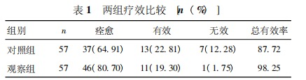
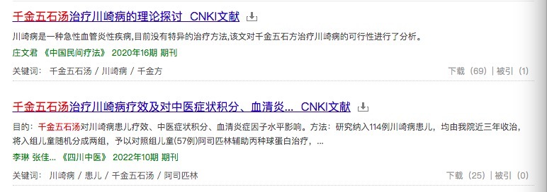
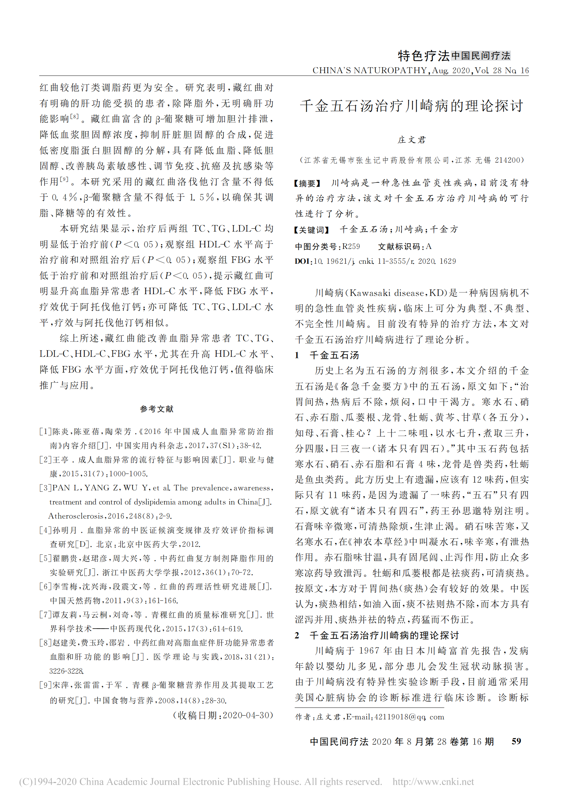
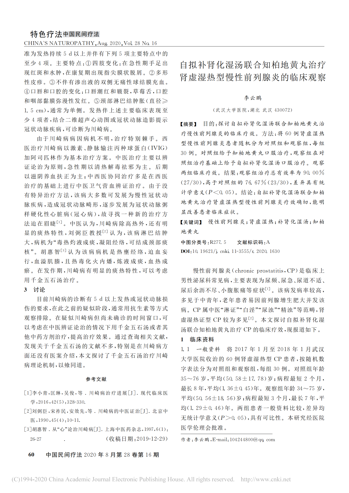
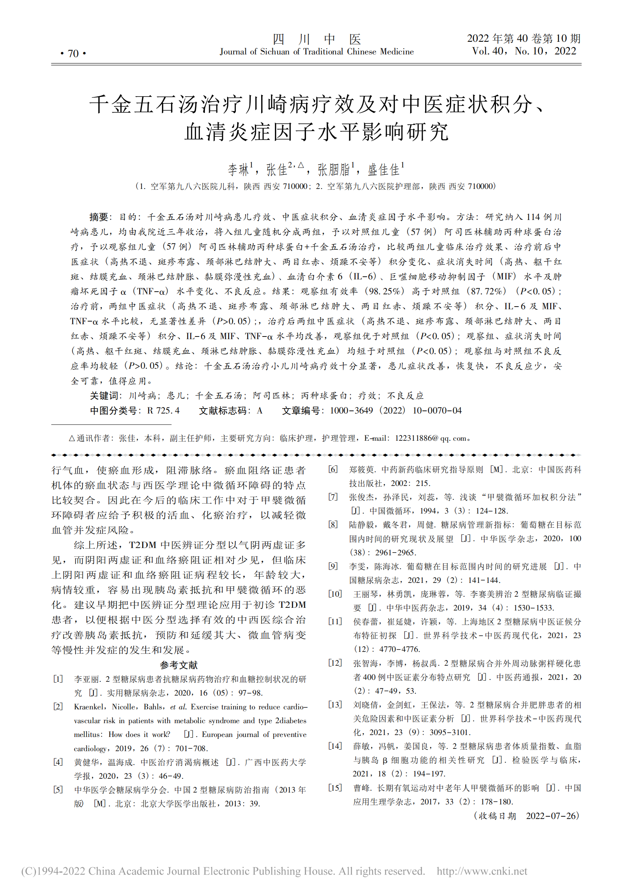
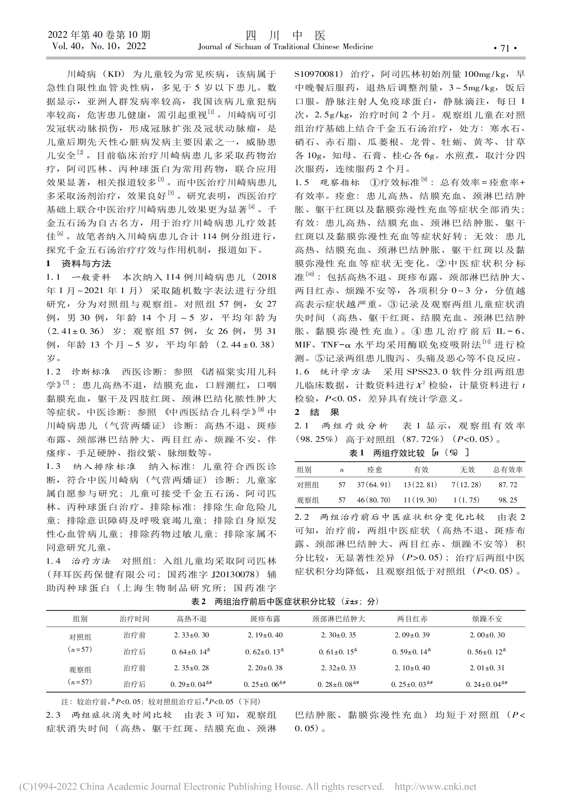
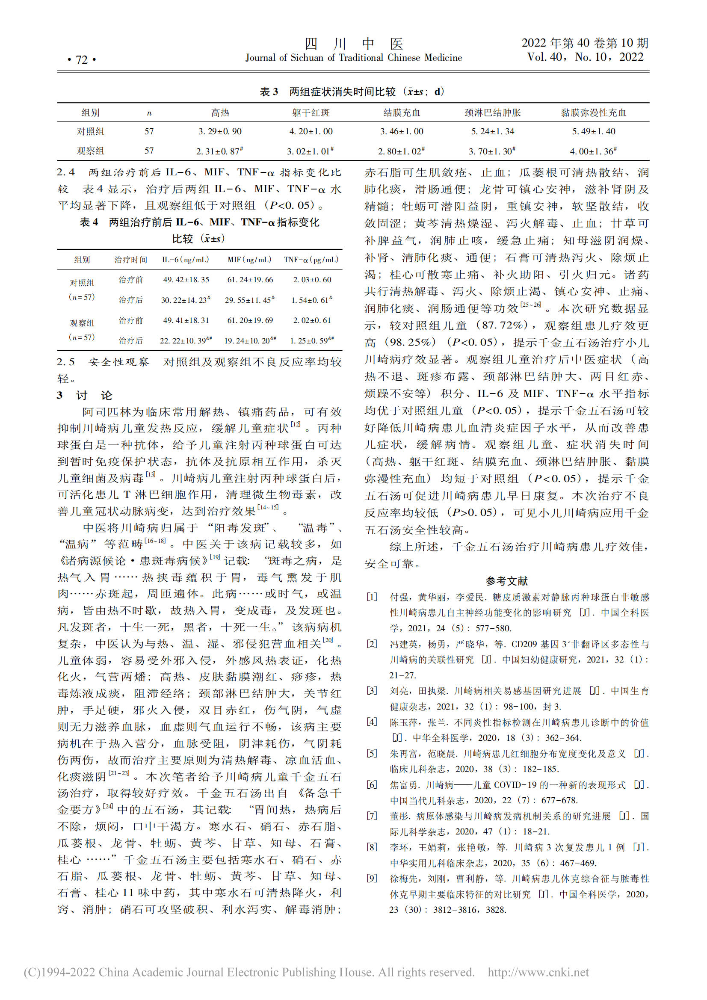
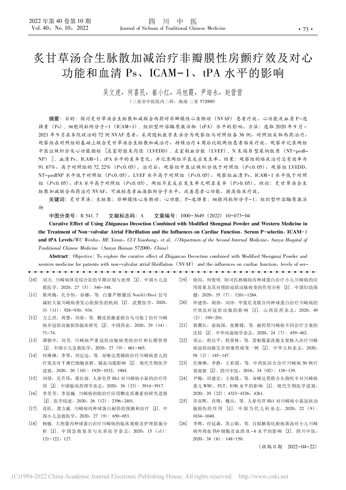

# 千金五石汤治疗川崎病取得良好效果

2015年，我的孩子得了川崎病，在儿童医院治疗，采用的是传统的丙球蛋白，效果很好，但毕竟是血液制品，风险也很大。

2020年，经过我的5年研究，终于有了一个理论突破，发表了文章《千金五石汤治疗川崎病的理论探讨》，认为千金五石汤可以治疗川崎病，但苦于没有实战机会，这两年一直在做推广工作，希望有机会接触到这些病的大夫能采用千金五石汤治疗。

2022年10月，四川中医发表了《千金五石汤治疗川崎病疗效及对中医症状积分、血清炎症因子水平影响研究》，效果很好，特别是里面提到，对照组和治疗组各57个，无效的对照组7个，治疗组1个，总有效率从87%提高到98%。

 

希望推广该方法：能把该方法写进川崎病治疗指南，让得川崎病的孩子少受罪。

### 附1、知网文章查询信息

 

### 附2、千金五石汤治疗川崎病理论探讨_庄文君（2020年8月发表）

 

[点击查看pdf格式](./千金五石汤治疗川崎病的理论探讨_庄文君.pdf)

 

### 附3、千金五石汤治疗川崎病疗效及对中医症状积分、血清炎症因子水平影响研究-  西京医院李琳等（2022年10月发表）

 

[点击查看pdf格式](./千金五石汤治疗川崎病疗效及对中医症状积分、血清炎症因子水平影响研究.pdf)

